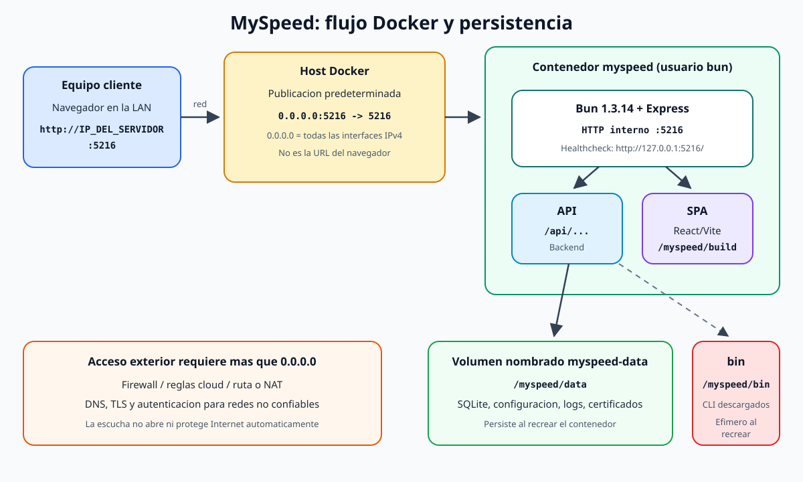

# Arquitectura de la solucion

La edicion Docker ejecuta MySpeed como un unico servicio de aplicacion. Bun inicia Express; Express expone la API y sirve el frontend React/Vite ya compilado. SQLite guarda el estado predeterminado en un volumen nombrado. No hace falta Nginx ni un contenedor frontend separado.



## Recorrido de una solicitud

1. Un navegador de la red solicita `http://IP_DEL_SERVIDOR:5216`.
2. Docker escucha, de forma predeterminada, en `0.0.0.0:5216` del host.
3. La publicacion de puertos redirige esa conexion al puerto `5216` del contenedor.
4. Express decide si la ruta pertenece a `/api/...` o al frontend.
5. Para una ruta de interfaz, Express devuelve los archivos compilados de `/myspeed/build`.
6. Para una ruta de API, el backend lee o modifica la configuracion y los resultados.
7. Con `DB_TYPE=sqlite`, Sequelize usa `/myspeed/data/storage.db`.

`0.0.0.0` no es una URL que se deba escribir en otro equipo. Significa "todas las interfaces IPv4 de este servidor". El cliente usa una direccion alcanzable, por ejemplo `http://192.168.1.50:5216`.

## Componentes

| Componente | Responsabilidad | Ubicacion en ejecucion |
| --- | --- | --- |
| Docker Compose | Construye, configura, publica puertos y conecta el volumen | Host |
| Imagen Docker | Empaqueta runtime, codigo, dependencias y frontend compilado | Almacen de imagenes Docker |
| Bun 1.3.14 | Ejecuta el backend JavaScript | Contenedor |
| Express 5 | API HTTP y servidor de la SPA | `/myspeed/server` |
| React/Vite | Interfaz compilada durante el build | `/myspeed/build` |
| Sequelize | Abstraccion de persistencia | Dependencias de produccion |
| SQLite | Base predeterminada, sin servidor externo | `/myspeed/data/storage.db` |
| CLI de velocidad | LibreSpeed, Ookla y Cloudflare | `/myspeed/bin` |
| Volumen `myspeed-data` | Estado que sobrevive recreaciones | Montado en `/myspeed/data` |

## Build y runtime son fases distintas

Durante el build:

- se descarga la imagen `oven/bun:1.3.14`;
- se instalan las dependencias del cliente usando su lockfile;
- Vite compila React en archivos estaticos;
- se instalan solo las dependencias de produccion del servidor;
- se generan los indices de migraciones e integraciones;
- se monta la imagen final con el resultado, no con todas las herramientas intermedias.

Durante cada arranque:

- el backend autentica la base de datos;
- aplica migraciones pendientes;
- carga integraciones e interfaces;
- si no esta en preview, verifica los CLI y descarga los que falten;
- inserta valores de configuracion iniciales;
- programa las pruebas e integraciones;
- comienza a escuchar en HTTP y, si hay certificados validos, en HTTPS.

La aplicacion llama a `app.listen` despues de cargar los CLI. Por eso el primer arranque puede tardar y el `HEALTHCHECK` concede 120 segundos iniciales.

## Persistente frente a efimero

```text
/myspeed
├── server/              imagen, inmutable para el usuario bun
├── node_modules/        imagen, inmutable para el usuario bun
├── build/               imagen, frontend compilado
├── data/                VOLUMEN, persistente y escribible
│   ├── storage.db       SQLite normal
│   ├── storage_preview.db  SQLite de preview, si se usa
│   ├── certs/           cert.pem y key.pem opcionales
│   ├── logs/
│   └── servers/
└── bin/                 capa del contenedor, escribible pero no persistente
```

El volumen cubre solo `/myspeed/data`:

- `docker compose restart` conserva `data` y `bin`, porque reinicia el mismo contenedor;
- `docker compose up -d --force-recreate` conserva `data`, pero crea un `bin` vacio y vuelve a descargar los CLI;
- `docker compose down` elimina contenedor y red, pero conserva el volumen;
- `docker compose down -v` elimina tambien el volumen y, por tanto, el estado persistente.

Esta distincion es deliberada: las bases y certificados son datos; los CLI descargables son cache efimera.

## Red y puertos

| Capa | HTTP | HTTPS | Quien lo controla |
| --- | ---: | ---: | --- |
| Host | `${MYSPEED_HTTP_PORT:-5216}` | `${MYSPEED_HTTPS_PORT:-5217}` | `.env` / Compose |
| Contenedor | `5216` | `5217` | `compose.yaml` |
| Aplicacion | `SERVER_PORT=5216` | `HTTPS_PORT=5217` | `environment` de Compose |

Cambiar `MYSPEED_HTTP_PORT=8080` produce `0.0.0.0:8080:5216`: desde fuera se usa `http://IP_DEL_SERVIDOR:8080`, mientras Express continua en `5216` dentro del contenedor.

El puerto `5217` se publica siempre, pero la aplicacion solo crea el servidor HTTPS si encuentra ambos archivos:

```text
/myspeed/data/certs/cert.pem
/myspeed/data/certs/key.pem
```

Publicar `5217` no genera certificados ni activa TLS por si mismo.

## Acceso exterior: que resuelve cada capa

El valor predeterminado `MYSPEED_BIND_IP=0.0.0.0` permite que Docker acepte conexiones dirigidas a cualquier IPv4 del host. Todavia pueden ser necesarios:

- una regla del firewall local para el puerto elegido;
- una regla de entrada del proveedor cloud;
- una ruta o VLAN que permita llegar al servidor;
- NAT/port forwarding si se entra desde Internet a una red privada;
- DNS si se desea un nombre;
- TLS y una capa adicional de autenticacion para redes no confiables.

Por eso "escucha en todas las interfaces" no equivale a "esta publicado de forma segura en Internet".

## Base de datos

### SQLite, valor predeterminado

`DB_TYPE=sqlite` no requiere otro servicio. La base esta dentro de `myspeed-data`, por lo que una recreacion de la aplicacion no elimina el historial.

### MySQL, opcion avanzada

`DB_TYPE=mysql` cambia Sequelize a MySQL. Requiere `DB_NAME`, `DB_USER` y `DB_PASS`; `DB_HOST` queda en `localhost` si esta vacio. Dentro de un contenedor, `localhost` significa el propio contenedor, no el host Docker. En un despliegue real se debe indicar un nombre DNS o IP alcanzable. La aplicacion no ofrece `DB_PORT`; usa el puerto MySQL predeterminado `3306`.

MySQL introduce una dependencia externa y deja de ser el modo "solo Docker con SQLite" de la clase. Aunque se use MySQL, `/myspeed/data` sigue siendo util para logs, servidores y certificados.

## Salud y privilegios

El contenedor ejecuta la aplicacion como el usuario no privilegiado `bun`. El codigo y las dependencias pertenecen a `root`; solo `data` y `bin` son escribibles. `no-new-privileges:true` evita elevar privilegios.

El `HEALTHCHECK` se ejecuta dentro del contenedor y consulta:

```text
http://127.0.0.1:5216/
```

Este `127.0.0.1` es correcto y no contradice la publicacion externa. En el healthcheck significa "el propio contenedor". Comprueba que Express responde sin depender de la IP ni del puerto configurado en el host.

## Dependencias de red saliente

Aunque el host solo necesite Docker instalado, el sistema requiere Internet en varios momentos:

- build: imagen base y dependencias Bun;
- primer arranque o recreacion: descargas de los tres CLI;
- pruebas de velocidad: comunicacion con servidores de medicion;
- comprobaciones o integraciones que el usuario configure.

Un proxy, DNS roto, bloqueo de GitHub/proveedores o certificados CA corporativos pueden hacer que el contenedor tarde o no llegue a estado saludable.
